# fractalartmaker
A module for creating fractal art in Python's turtle module.

Fractals are recursive, self-similar shapes. The `fractalartmaker` module (abbreviated as `fam`) helps you create fractals in the Python programming language using Python's built-in `turtle` module. This module is based on the "Fractal Art Maker" chapter of the free book, [The Recursive Guide to Recursion](https://inventwithpython.com/recursion/) by Al Sweigart. Additional changes have been made to make it easier to use and experiment with.

Quickstart
===========

Run `pip install fractalartmaker` to install. Run `python -m fractalartmaker` on Windows or `python3 -m fractalartmaker` on macOS to run the demo and view nine pieces of fractal art made by Al Sweigart.

First, you must know a little bit of Python programming and Python's `turtle` module. [RealPython.com has a `turtle` module tutorial.](https://realpython.com/beginners-guide-python-turtle/)

You can view a demo fractal by running the following code from the interactive shell (aka the REPL):

    >>> import fractalartmaker as fam
    >>> fam.demo_four_corners()

This draws the Four Corners fractal in a new turtle window. Once you've learned how Fractal Art Maker works, you can call the `fam.draw_fractal()` function yourself:

    >>> import fractalartmaker as fam
    >>> fam.draw_fractal(fam.square, 100, [{'size': 0.96, 'y': 0.5, 'angle': 11}], max_depth=100)

This draws a fractal similar to the Horn demo fractal.

Gallery of Demo Fractals
=================

`fam.demo_four_corners()`

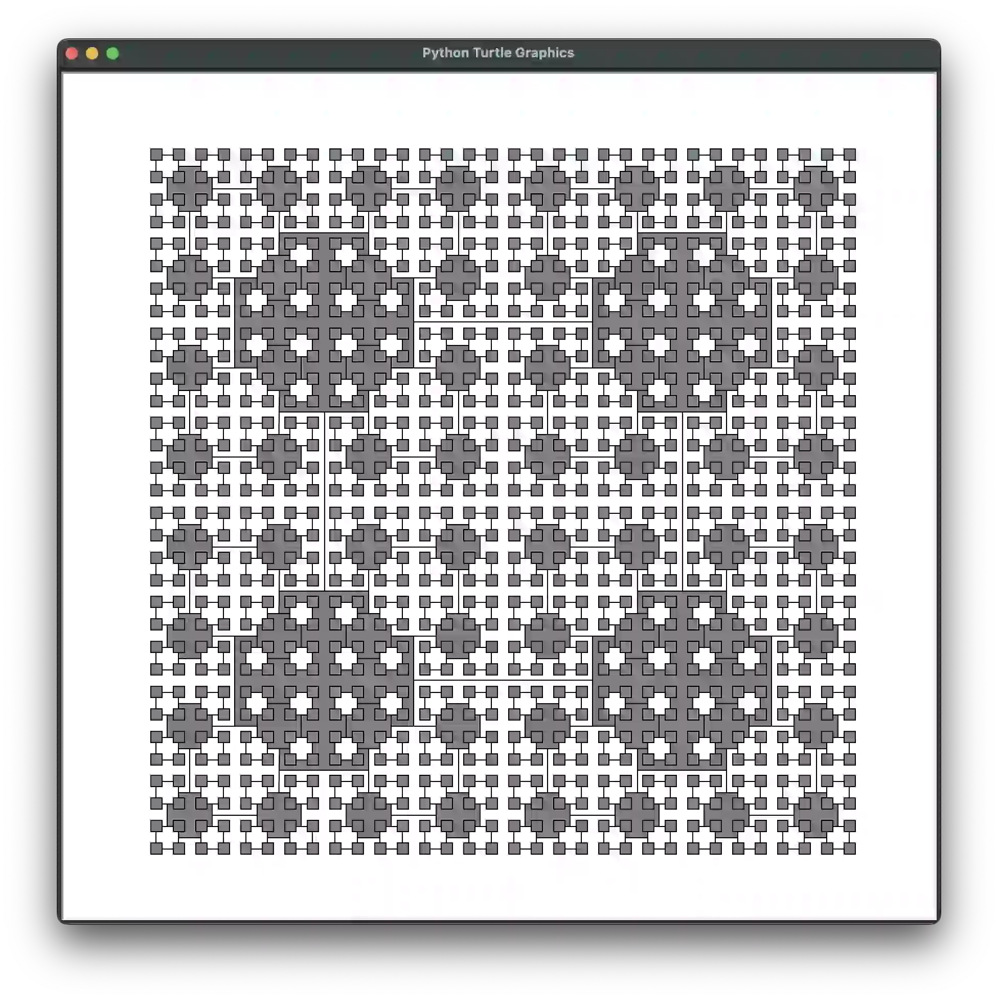

`fam.demo_spiral_squares()`

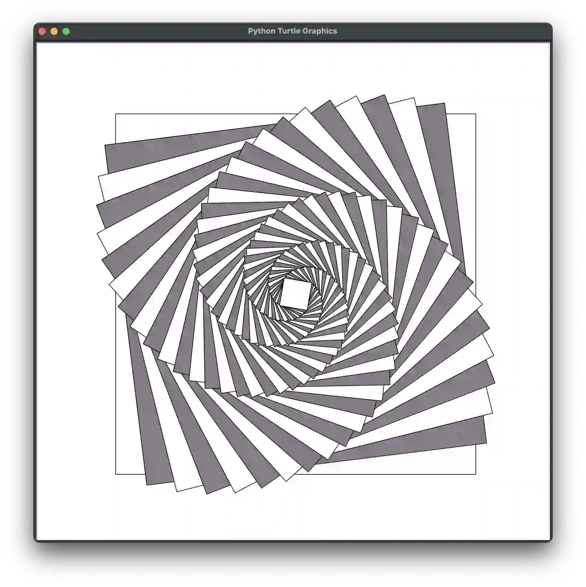

`fam.demo_double_spiral_squares()`

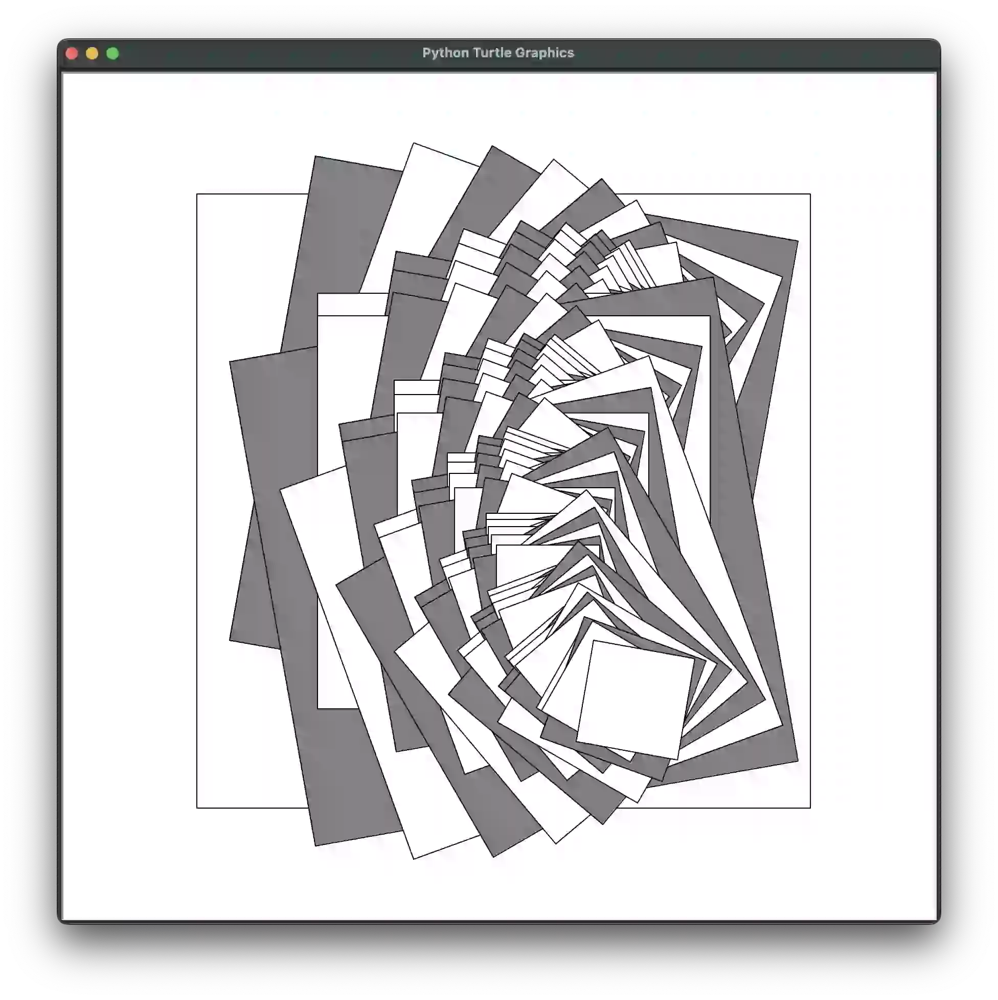

`fam.demo_triangle_spiral()`

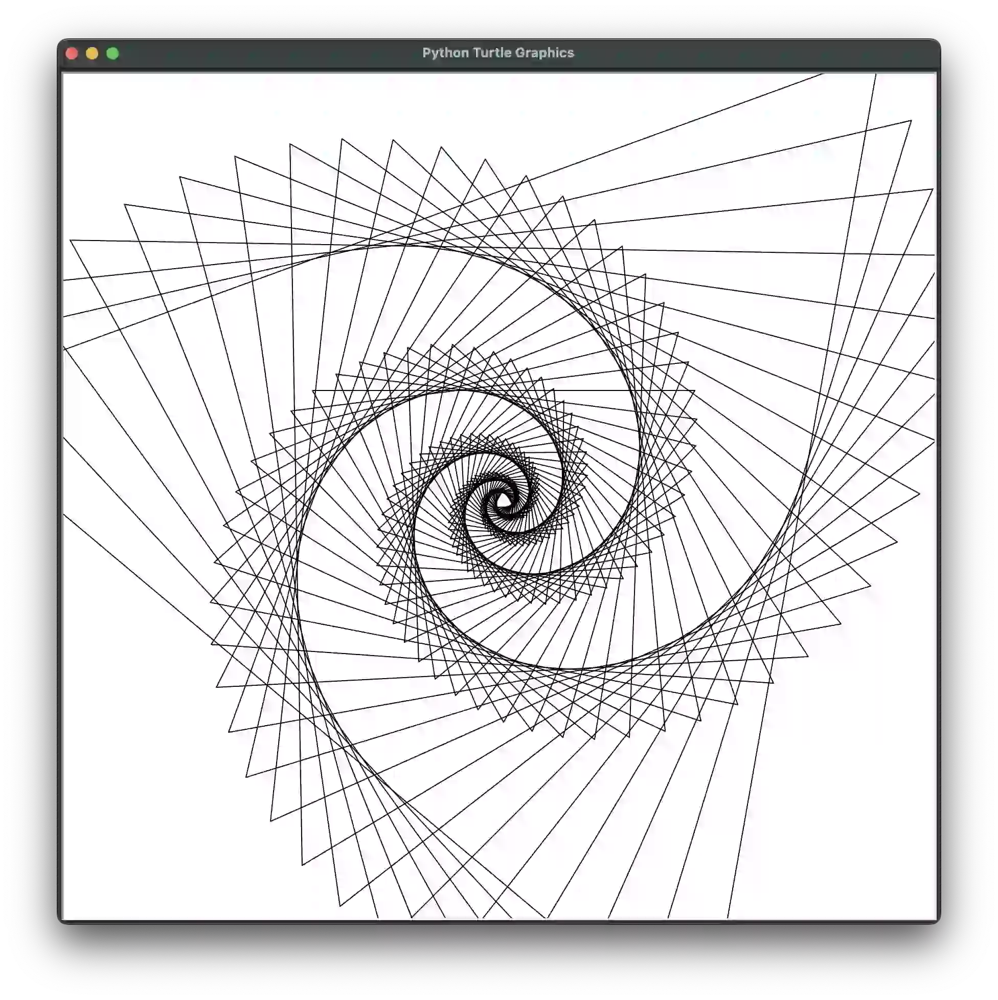

`fam.demo_glider()`

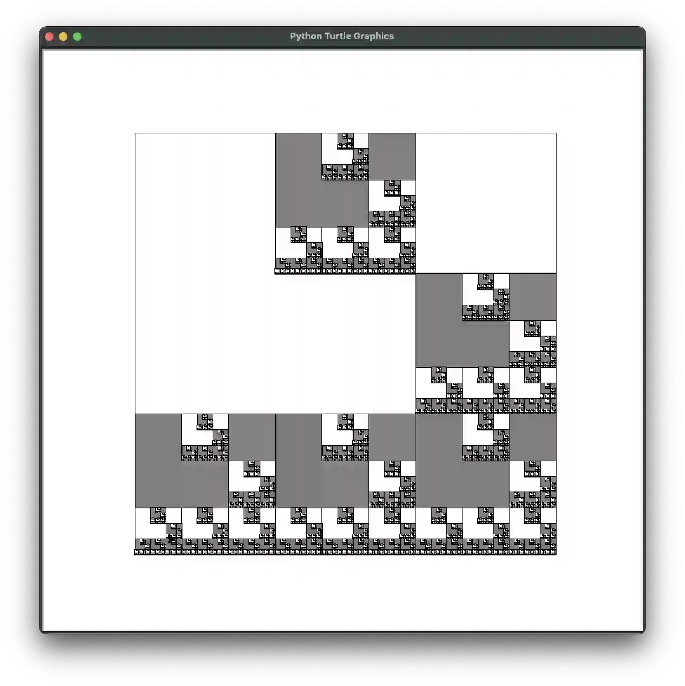

`fam.demo_sierpinski_triangle()`

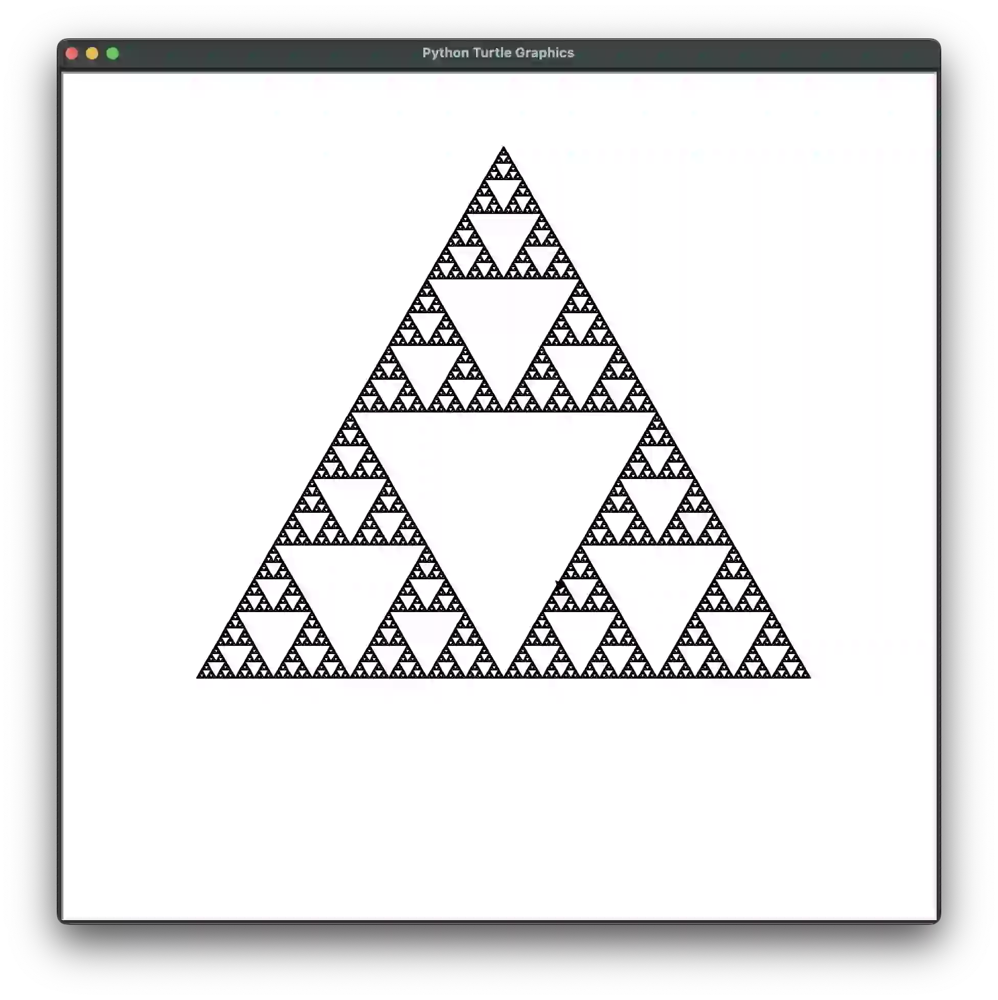

`fam.demo_wave()`

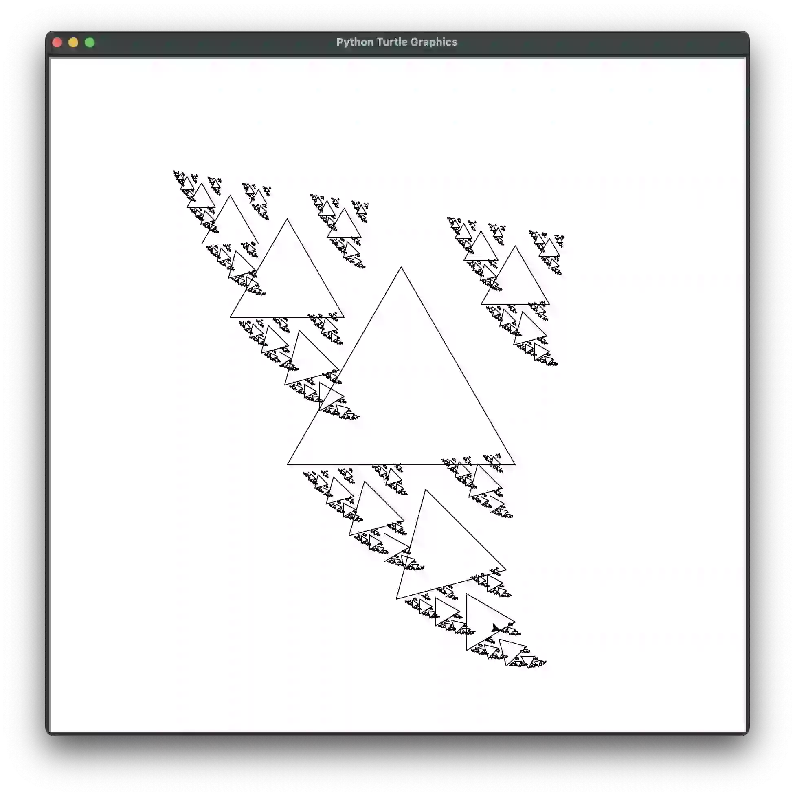

`fam.demo_horn()`

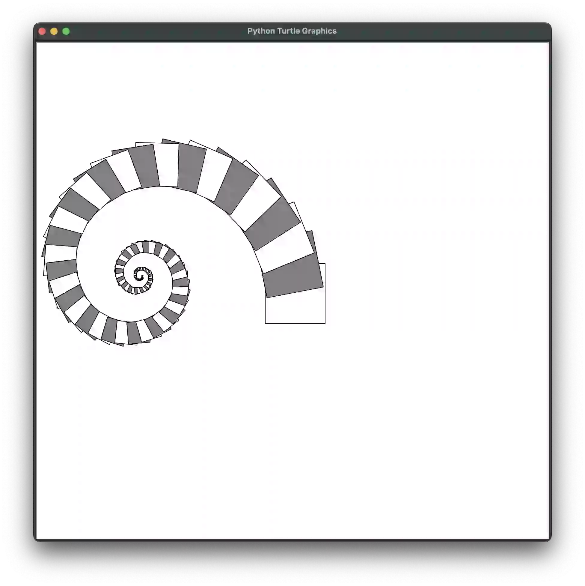

`fam.demo_snowflake()`

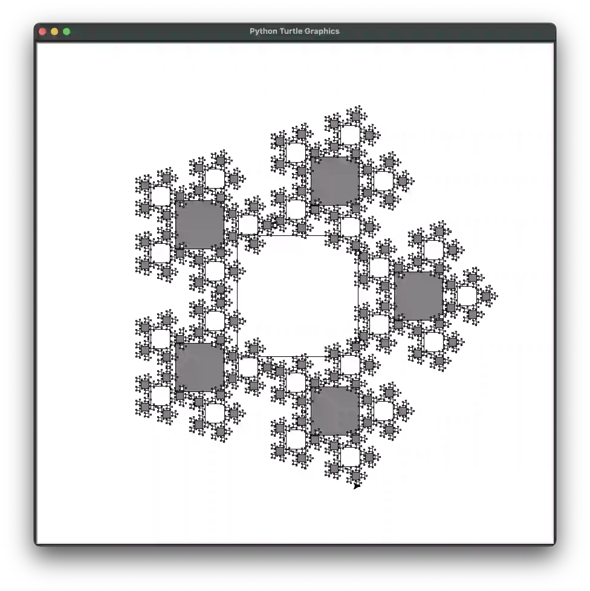

Creating Your Own Fractals
=======================

Creating a fractal with Fractal Art Maker involves two parts.

First, you need to write what I call a *shape-drawing function*. This is a function that uses `turtle` functions to draw a simple shape that will be redrawn dozens or hundreds of times for your fractal. The function must take at least two parameters: the first is named `size` and the second is named `depth`.

For example, this shape-drawing function that draws a square (the `depth` argument is ignored):

    def square(size, depth):
        # Move to the top-right corner before drawing:
        turtle.penup()
        turtle.forward(size // 2)
        turtle.left(90)
        turtle.forward(size // 2)
        turtle.left(180)
        turtle.pendown()

        # Draw a square:
        for i in range(4):  # Draw four lines.
            turtle.forward(size)
            turtle.right(90)

The `fam` library calls your shape-drawing function and provides it with the appropriate `size` argument. The size of your shape just has to be relative to whatever number is passed for this 

Your shape-drawing function must draw a shape relative to the size of `size` and whatever direction it is currently facing. Use relative `turtle` functions like `forward()`, `back()`, `left()`, and `right()` rather than absolute functions like `goto()` or `setheading()`. The argument you pass to `forward()` and `back()` calls should always depend on the `size` argument rather than be a static, fixed number.

The `depth` argument is the level of recursion that the shape has been drawn at. So for the first level it is `0`, the second level it is `1`, and so on. You could use to do some more advanced effects (discussed later).

Your shape-drawing function does not call itself or do any recursion. Keep it simple: It just draws a shape using the `turtle` functions.

The `fam` library has some shape-drawing functions for you to use: `fam.square()` and `fam.triangle()`

Second, you must call the `fam.draw_fractal()` function and pass three things: a shape-drawing function, the starting size (`100` is often good), and a list of *recursion-specification dictionaries*. Each dictionary in this list specifies how the shape changes at each level of recursion: `'size'` for size changes, `'x'` for left/right movement, `'y'` for up/down movement, and `'angle'` for rotation.

Note that for Fractal Art Maker's recursion-specification dictionaries, a positive `'y'` goes up and a negative `'y'` goes down. (It's like graphs in school math class, rather than computer graphics.)

For example, let's take a look at the Horn demo fractal that comes with Fractal Art Maker. You can see it by running `import fractalartmaker as fam; fam.demo_horn()`:

This fractal is made by drawing a square, then recursively drawing a second square that is:

* Slightly smaller. (96% of the previous square's size, to be exact.)
* Placed above. (A distance that is 50% of the previous square's size, to be exact.)
* Rotated clockwise a little. (11 degrees, to be exact.)

This second square (which is gray, as this fractal alternates between white and gray squares) in turn recursively produces *a third square that is slightly smaller, placed above, and rotated clockwise a little.* Note that since the second was rotated left/clockwise, it's "up" is actually rotated as well. This is why the subsequent squares tilt to the left.

We can draw this with the following recursion-specifiction dictionary: `{'size': 0.96, 'y': 0.5, 'angle': 11}`

So to draw the Horn fractal in Fractal Art Maker, we run the following code:

    >>> import fractalartmaker as fam
    >>> fam.draw_fractal(fam.square, 100, [{'size': 0.96, 'y': 0.5, 'angle': 11}], max_depth=100)

The `max_depth` keyword argument is how many levels of recursion you want to make. By default it is set to `8`.

If we pass an `'x'` or `'y'` argument of `0.0`, the next recursive shape is not moved at all from the parent shape's position. If we pass a `'size'` of `1.0`, the next recursive shape is the same size as the parent shape's size. If we pass an `'angle'` of `0`, the next recursive shape is not rotated. These are also the default values if you leave out the key from the dictionary altogether.

While `'angle'` is always an absolute number of degrees to rotate, the `'x'`, `'y'`, and `'size'` values are always relative to the current size of the shape-drawing function's shape.

Let's do another example similar to the Four Squares demo. Run `fam.reset()` to clear the turtle window and put the turtle cursor back at 0, 0. (This function is the same as `turtle.reset()`.) I want to draw square and then the recursive step to draw smaller square to the up and left of the previous square (and no rotation). Run the following code:

    >>> import fractalartmaker as fam
    >>> fam.draw_fractal(fam.square, 350, [{'size': 0.5, 'x': -0.5, 'y': 0.5}], max_depth=5)

This code draws the following:

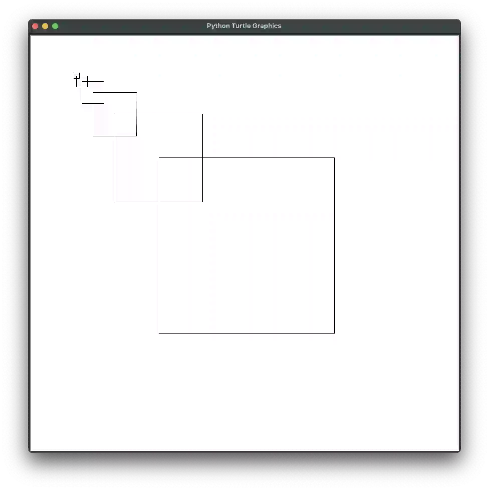

The `max_depth=5` keyword argument prevents too many squares from being drawn. (The default maximum recursive depth is 8.)

We can add a second recursive square to all of these squares by adding a second recursion-specification dictionary to the list. This second dictionary will draw another recursive step *up and to the right*. Continue the interactive shell example with the following code. Notice how the second dictionary has an `'x'` of `0.5` instead of `-0.5`:

    >>> fam.reset()  # Clears the screen.
    >>> fam.draw_fractal(fam.square, 350, [{'size': 0.5, 'x': -0.5, 'y': 0.5}, {'size': 0.5, 'x': 0.5, 'y': 0.5}], max_depth=5)

This code draws the following:

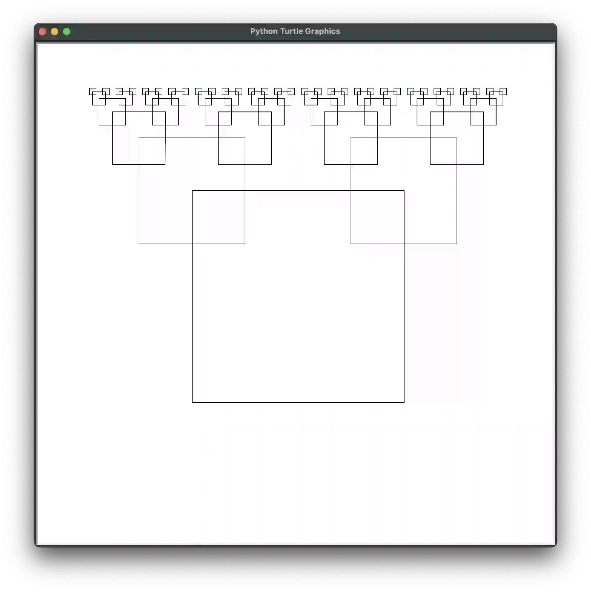

Keep in mind that it isn't just the first square that gets two recursive squares, but *every* square that gets two recursive squares.

And we can add a third square by adding a third specification dictionary to the list, this one with a `'y'` of `-0.5`:

    >>> fam.reset()  # Clears the screen.
    >>> fam.draw_fractal(fam.square, 350, [{'size': 0.5, 'x': -0.5, 'y': 0.5}, {'size': 0.5, 'x': 0.5, 'y': 0.5}, {'size': 0.5, 'x': -0.5, 'y': -0.5}], max_depth=5)

This code draws the following:

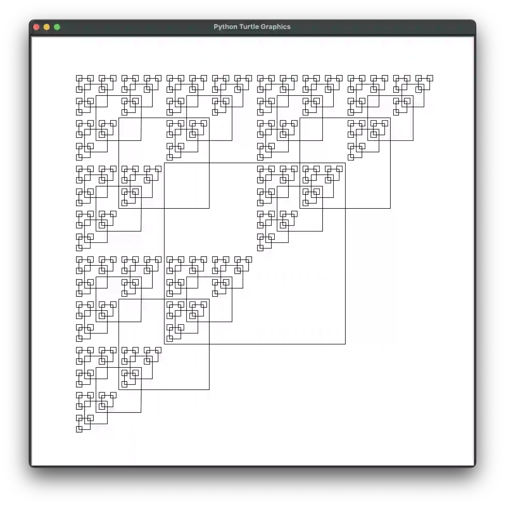

Finally, we can add a fourth square:

    >>> fam.reset()  # Clears the screen.
    >>> fam.draw_fractal(fam.square, 350, [{'size': 0.5, 'x': -0.5, 'y': 0.5}, {'size': 0.5, 'x': 0.5, 'y': 0.5}, {'size': 0.5, 'x': -0.5, 'y': -0.5}, {'size': 0.5, 'x': 0.5, 'y': -0.5}], max_depth=5)

This code draws the following:

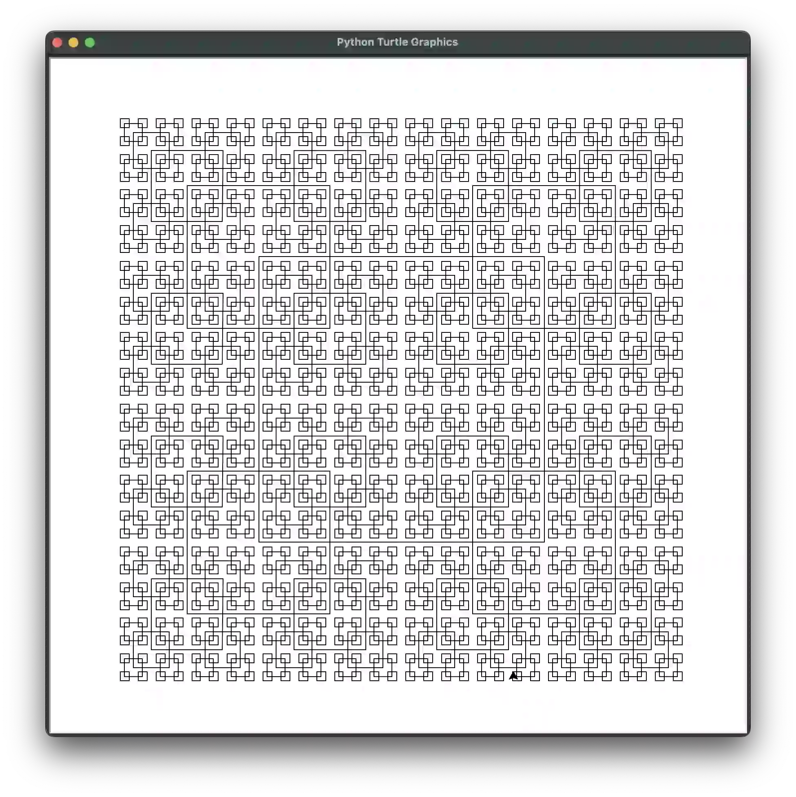

You'll notice that this fractal isn't quite the same as the `fam.demo_four_corners()` one. We can alternate between white and gray fill colors for the square in the shape-drawing function. Let's take a look at that next.

Advanced Features of FAM's Shape-Drawing Functions
==========================

All shape-drawing functions are passed a `size` argument and a `depth` argument. We can make the white-and-gray alternating colors by examining the `depth` argument. In the following shape-drawing function, the fill color for the square is set to white or gray depending on the recursive depth:

    def square_alternating_white_gray(size, depth):
        # Move to the top-right corner before drawing:
        turtle.penup()
        turtle.forward(size // 2)
        turtle.left(90)
        turtle.forward(size // 2)
        turtle.left(180)
        turtle.pendown()

        # Set fill color:
        if depth % 2 == 0:
            turtle.fillcolor('white')
        else:
            turtle.fillcolor('gray')

        # Draw a square:
        turtle.begin_fill()
        for i in range(4):  # Draw four lines.
            turtle.forward(size)
            turtle.right(90)
        turtle.end_fill()

You can write your shape-drawing functions however you want. TODO: This section is incomplete.

Python Turtle Module Cheat Sheet
===============================

    import turtle
    turtle.forward(100)   # Move forward 100 steps.
    turtle.backward(100)  # Move backwards 100 steps.
    turtle.left(90)       # Turn left/clockwise 90 degrees.
    turtle.right(90)      # Turn right/counterclockwise 90 degrees.

    turtle.position()  # Return (0, 0), the current XY position of the turtle.
    turtle.heading()   # Return 0.0, the current heading/direction of the turtle. (0 is right, 90 is up, 180 is left, 270 is down)

    turtle.goto(30, 25)     # Move turtle to X of 30 and Y of 25.
    turtle.setx(30)         # Move turtle left/right to X of 30 and current Y coordinate.
    turtle.sety(25)         # Move turtle up/down to Y of 25 and current X coordinate.
    turtle.towards(30, 25)  # Return degrees to turn left to face XY 30, 25 from current position/heading.
    turtle.setheading(90)   # Make the turtle face up (90 degrees).

    turtle.penup()    # "Raise the pen" and stop drawing as the turtle moves.
    turtle.pendown()  # "Lower the pen" and start drawing as the turtle moves.

    turtle.pensize(4)       # Set pen thickness size to 4. (Default is 1.)
    turtle.width()          # Return 4, the current pen thickness size.
    turtle.pencolor('red')  # Lines drawn will now be red. (Also use color formats '#FF0000' or (255, 0, 0))

    turtle.fillcolor('white')  # Set fill color of begin_fill() and end_fill() to white.
    turtle.begin_fill()        # Start drawing a filled-in shape.
    turtle.end_fill()          # End drawing a filled-in shape and draw the fill color.

    turtle.home()   # Move the turtle to 0, 0 and facing right (0 degrees).
    turtle.clear()  # Erase all drawings on the screen, but leave the turtle in its place.
    turtle.reset()  # Erase all drawings and move turtle to 0, 0 and facing right.

    turtle.hideturtle()  # Don't show the turtle cursor in the window.
    turtle.showturtle()  # Show the turtle cursor in the window.

    turtle.bgcolor('blue')  # Make the background color of the window blue. (Default is white.)

    turtle.tracer(1000, 0)  # Do 1000 turtle commands with 0 delay all at once. (Increase 1000 to make drawing speed faster.)
    turtle.update()         # Call this when done to update the screen with any remaining turtle commands' drawings.

    turtle.exitonclick()  # Close the window when the user clicks it.

Short Function Names Cheat Sheet
================

    turtle.fd()  # forward()
    turtle.bk()  # backward()
    turtle.lt()  # left()
    turtle.rt()  # right()

    turtle.pos()  # position()

    turtle.pd()  # pendown()
    turtle.pu()  # penup()

